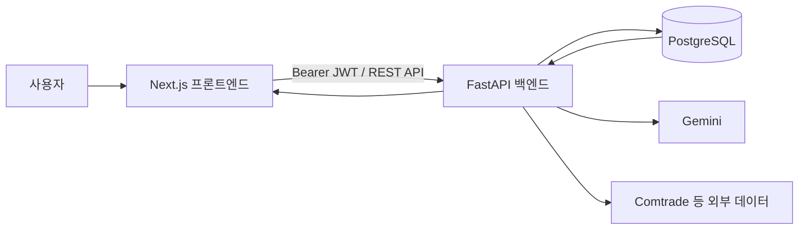

# SupplyGuard

SupplyGuard는 기업의 조달 품목과 국가별 공급망 위험을 분석하고, 대체 공급국·공급사를 추천해 의사결정을 돕는 공급망 리스크 관리 서비스입니다. 품목 등록부터 SGRI 분석, 추천, AI 보고서, 조달 검토 보드까지 하나의 흐름으로 연결합니다.

- 프론트엔드 데모: [https://supply-guard-one.vercel.app](https://supply-guard-one.vercel.app)
- API 문서(로컬): [http://localhost:8000/docs](http://localhost:8000/docs)
- 프로젝트: 국민대학교 학술제 13조

> 배포 화면에서 `Failed to fetch`가 표시되면 데이터가 없는 문제가 아니라, 대부분 프론트엔드가 백엔드에 연결되지 못한 상태입니다. `NEXT_PUBLIC_API_BASE_URL`, 백엔드 배포 상태, CORS의 `FRONTEND_ORIGIN`을 먼저 확인하세요.

## 주요 기능

| 기능 | 설명 | 현재 상태 |
|---|---|---|
| 대시보드 | 내 품목·국가 검색, 최근 리스크 및 추천 요약 | 구현 |
| 품목 관리 | 등록 품목 목록, 최고 SGRI, 상세·추천·보고서 이동, 삭제 | 구현 |
| 신규 품목 분석 | 품목 등록 후 build-SGRI 작업 실행, 폴링 및 진행 상태 표시 | 구현 |
| 리스크·추천 | 국가별 SGRI 확인, 대체 공급국·공급사 추천 | 구현 |
| 추천 피드백 | 국가 추천에 도움 여부를 저장 | 구현 |
| AI 보고서 | 비동기 분석 작업 실행 및 결과 확인 | 구현, Pro 이상 |
| 구독·요금제 | Basic·Pro·Enterprise 비교, 사용량 및 402 paywall 안내 | 데모 결제 방식 구현 |
| AI 어시스턴트 | 로그인 사용자의 SGRI·추천·알림 데이터를 활용한 멀티턴 Q&A | UI·API 구현, 운영 AI 연동 확인 필요 |
| 조달 검토 보드 | 국가·기업·메모를 칸반으로 관리하고 추천 화면에서 카드 추가 | 구현 |
| Google 로그인 | Google Identity Services ID 토큰을 백엔드 JWT로 교환 | 구현, 운영 Client ID 설정 필요 |

## 서비스 흐름



로그인 토큰은 `localStorage.access_token`에 저장되며, 프론트엔드의 `api.ts`가 인증 요청에 `Authorization: Bearer <token>` 헤더를 자동으로 첨부합니다.

## 기술 스택

| 영역 | 기술 |
|---|---|
| Frontend | Next.js 15, React 19, TypeScript, Tailwind CSS, Radix UI, Recharts |
| Backend | FastAPI, SQLAlchemy, Pydantic, JWT, Google OAuth |
| Database | PostgreSQL 17 |
| AI·데이터 | Gemini, UN Comtrade 및 공급망 지표 수집 파이프라인 |
| Deployment | Docker Compose, Vercel, Railway |

## 저장소 구조

```text
.
├── Frontend/       # Next.js 웹 애플리케이션
├── backend/        # FastAPI 서버와 REST API
├── database/       # PostgreSQL 스키마, 마이그레이션, 시드 및 수집 코드
├── AI_Model/       # SGRI 계산·분석 모델
├── docs/           # 요구사항, OAuth 및 배포 문서
├── docker-compose.yml
└── .env.example
```

## 빠른 시작: Docker Compose

### 1. 환경변수 준비

```bash
cp .env.example .env
```

`.env`에서 최소 `DB_PASSWORD`, `GEMINI_API_KEY`, `SECRET_KEY`를 실제 값으로 변경합니다. Google 로그인을 사용할 경우 `GOOGLE_CLIENT_ID`와 `NEXT_PUBLIC_GOOGLE_CLIENT_ID`에도 동일한 OAuth Client ID를 입력합니다.

### 2. 전체 서비스 실행

```bash
docker compose up --build
```

| 서비스 | 주소 |
|---|---|
| Frontend | [http://localhost:3000](http://localhost:3000) |
| Backend Swagger | [http://localhost:8000/docs](http://localhost:8000/docs) |
| Backend health check | [http://localhost:8000/health](http://localhost:8000/health) |
| PostgreSQL | `localhost:5432` |

최초 실행 시 PostgreSQL이 비어 있으므로 스키마와 기준 데이터를 넣어야 합니다. 자세한 순서는 [배포 및 DB 시딩 가이드](docs/deployment.md)를 확인하세요.

## 개별 실행

### Frontend

요구사항: Node.js 20 이상

```bash
cd Frontend
npm ci
npm run dev
```

`Frontend/.env.local` 예시:

```dotenv
NEXT_PUBLIC_API_BASE_URL=http://localhost:8000/api/v1
NEXT_PUBLIC_GOOGLE_CLIENT_ID=your-google-oauth-client-id.apps.googleusercontent.com
```

### Backend

요구사항: Python 3.11 이상, 실행 중인 PostgreSQL

```bash
cd backend
python -m venv .venv
source .venv/bin/activate
pip install -r requirements.txt
uvicorn app.main:app --reload
```

백엔드 환경변수와 DB 준비 방법은 [백엔드 안내](backend/README.md)와 [배포 가이드](docs/deployment.md)를 참고하세요.

## 주요 환경변수

| 변수 | 대상 | 필수 | 설명 |
|---|---|---:|---|
| `DB_PASSWORD` | Backend·DB | 예 | PostgreSQL 비밀번호 |
| `GEMINI_API_KEY` | Backend | 예 | AI 설명·보고서·챗봇 생성 |
| `SECRET_KEY` | Backend | 예 | JWT 서명 키, 운영 환경에서는 충분히 긴 난수 사용 |
| `FRONTEND_ORIGIN` | Backend | 예 | CORS를 허용할 프론트엔드 Origin |
| `NEXT_PUBLIC_API_BASE_URL` | Frontend | 예 | `/api/v1`을 포함한 백엔드 API 주소 |
| `GOOGLE_CLIENT_ID` | Backend | Google 로그인 사용 시 | Google ID 토큰 검증용 Client ID |
| `NEXT_PUBLIC_GOOGLE_CLIENT_ID` | Frontend | Google 로그인 사용 시 | Google Identity Services 버튼용 Client ID |
| `ALLOW_STUB_LOGIN` | Backend | 아니요 | 이메일 데모 로그인 허용 여부. 운영 환경은 `false` 권장 |
| `COMTRADE_API_KEY` 등 | Backend | 아니요 | 신규 품목 build-SGRI 데이터 수집용 |

`.env`, API 키, DB 비밀번호는 Git에 커밋하지 마세요. Google OAuth 설정은 [Google 로그인 설정 가이드](docs/google-oauth-setup.md)를 따릅니다.

## 주요 화면

| 경로 | 용도 |
|---|---|
| `/login` | 이메일 데모 로그인 및 Google 로그인 |
| `/dashboard` | 리스크·추천 요약과 내 품목 검색 |
| `/items` | 감시 품목 목록 및 관리 |
| `/items/new` | 신규 품목 등록과 SGRI 분석 시작 |
| `/risks/{hsCode}` | HS 코드별 국가 리스크 상세 |
| `/recommendations?query_id={id}` | 대체 공급국·공급사 추천 |
| `/suppliers/{companyId}` | 공급사 상세 |
| `/reports/new?query_id={id}` | AI 보고서 생성 |
| `/reports/{reportId}` | 생성된 보고서 상세 |
| `/alerts` | 위험 알림 목록 |
| `/pricing` | 요금제 비교·변경 및 사용량 확인 |
| `/boards` | 조달 검토 보드 목록 |
| `/boards/{boardId}` | 칸반식 국가·기업 검토 워크스페이스 |
| `/settings` | 사용자 설정 |

로그인 이후 내부 화면에는 AI 어시스턴트 플로팅 위젯이 공통으로 표시됩니다. `/`와 `/login`에서는 표시하지 않습니다.

## 요금제와 paywall

- Basic: 월 30만 원, 품목 5개 한도
- Pro: 월 100만 원, AI 보고서 및 가중치 재계산 제공
- Enterprise: 월 300만 원 이상, 별도 견적

품목 한도 초과, AI 보고서 생성, 가중치 재계산 요청이 HTTP `402`를 반환하면 백엔드의 `detail` 메시지를 화면에 표시하고 `/pricing`으로 안내합니다. 현재 구독 변경은 시연용 즉시 반영 방식이며 실제 PG 결제는 연동되지 않았습니다.

## 개발 규칙

- API 요청은 공통 `api.ts`를 사용하고 인증 헤더를 직접 중복 구현하지 않습니다.
- 수치와 목록은 API 응답을 사용하며 화면에 결과 데이터를 하드코딩하지 않습니다.
- 비동기 화면에는 로딩·빈 상태·오류 문구를 모두 제공합니다.
- UI는 기존 shadcn/Radix UI와 Tailwind 패턴을 유지합니다.
- HTTP `402`의 `detail`은 사용자 안내 문구로 그대로 노출합니다.

## 코드 검증

```bash
cd Frontend
npm run typecheck
npm run lint
npm run build
```

현재 린트는 오류 없이 통과하며 일부 기존 파일에 사용하지 않는 import 경고가 남아 있을 수 있습니다.

## 남은 작업 및 논의 사항

- 알림 설정 저장 API와 화면 연동
- 실행 피드백 항목: 지표 상세 링크, 공통 사이드바, SGRI 방법론, 국가 비교, 국가·공급사 AI 설명 및 공급사 비교
- 벤치마크 API를 사용하는 프론트엔드 화면
- 대시보드의 전체 글로벌 품목·국가 탐색 검색 UX와 데이터 범위
- “도움이 안 됐어요” 이후 1위 국가를 제외해 재추천할지에 대한 정책
- 실제 결제·Enterprise 문의 흐름
- 운영 Google OAuth Client ID·Authorized Origin 설정 및 실계정 검증
- 배포 환경에서 사용자 데이터 기반 AI 챗봇과 외부 데이터 수집의 end-to-end 검증

전체 프론트엔드 요구사항과 진행 상황은 [프론트엔드 작업 목록](docs/frontend-tasks.md)에서 관리합니다.

## 관련 문서

- [프론트엔드 작업 목록](docs/frontend-tasks.md)
- [배포 가이드](docs/deployment.md)
- [Google OAuth 설정](docs/google-oauth-setup.md)
- [백엔드 안내](backend/README.md)
- [데이터베이스 안내](database/README.md)
